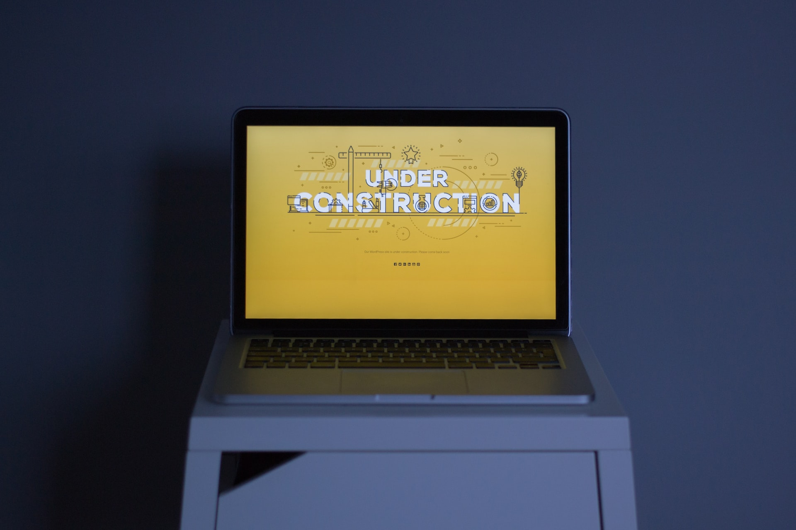

# **Math My Property - Real Estate Calculator**

## **Introduction**

This is a real estate app that allows landlords, investors, and prospective buyers to workout the returns a property will deliver them. The project will start out basic and i will expand it as time goes on to add more features. 

### **1. User Experience (UX)**
  * 1.1 Target audience
  * 1.2 Visitor goals
  * 1.3 Business goals
  * 1.4 User stories
  * 1.5 Design choices
  * 1.6 Wire frames

  ### **2. Features**
  * 2.1 The Navbar
  * 2.2 User Inputs
  * 2.3 Action Buttons
  * 2.4 Financial Breakdown
  * 2.5 Footer
  * 2.6 Features Left To Implement

  ### **3. Technologies/Languages Used**
  * 3.1 VSCode
  * 3.2 HTML5
  * 3.3 CSS
  * 3.4 JavaScript
  * 3.5 Bootstrap
  * 3.6 Google Fonts 
  * 3.7 Icons8
  * 3.8 Balsamiq
  * 3.9 Still to add animations
  * 3.10 Favicon.io

  ### **4. Testing**
  * 4.1 See [testing.md](testing.md) document 

### **5. Deployment**
  * 5.1 Deployment 
  * 5.2 Cloning 
  * 5.3 Cloning Desktop
  
### **6. Credits**
  * 6.1 Media
  * 6.2 Code
  * 6.3 Acknowledgements

### **7. Contact**
  * 7.1 LinkedIn
  * 7.2 Email
  * 7.3 Skype

### **8. Disclaimer**
  * 8.1 Disclaimer on project 

<strong>1.User Experience (UX)</strong>

 

#### **1.1 Target Audience**

* This website is aimed at anyone who either owns, or is considering buying an investment property and wants to understand the kind of returns that property may deliver.

#### **1.2 Visitor goals** 

* I want to be able to use the site to see at a glance the type of returns a property i own, or am thinking of buying, will return. 

#### **1.3 Business goals**

* No business or monetary goals, just a user friendly tool that lets users workout and breakdown their bills in a few clicks.

#### **1.4 User Stories**

* As a visitor to the company website i expect/want/need
 

#### **1.5 Design choices** 

* Project is still under construction so nothing finalized yet. 

#### **FONTS**

* The ont i have chosen for this project is [Didact Gothic](https://fonts.google.com/specimen/Didact+Gothic?query=dida&sort=popularity&preview.text=This%20is%20how%20the%20font%20will%20look&preview.text_type=custom#standard-styles). Didact Gothic is a sans-serif font designed to present each letter in the form most often used in elementary classrooms. This makes it suitable for literacy efforts.

#### **ICONS**

* I decided i would use [Icons8](https://icons8.com/) icons for the project. Icons8 has a wide range of colorful and animated icons that are free to use. 

#### **COLOURS**

* Project is still under construction so colours finalized yet. 

#### **1.6 Wire Frames** 

* The wireframes for the project can be seen below. There is a wireframe for desktop, tablet and mobile.

#### **DESKTOP**

#### **TABLET**

#### **MOBILE**

<strong>2. Features</strong>

 

#### **2.1 The Navbar**

* The Navbar is a standard bootstrap Navbar. It holds the company logo in the top left hand corner and menu items which are links. On mobile devices the logo and the site name will always stay visible.

#### **2.2 User Inputs** 

* The user only has several inputs to work with. The are:  

#### **2.3 Action Buttons**

* There are 2 button types for the user to interact with. The main one will trigger the calculated results once the user has added all of the information into the input fields. The second type of button is the reset button. Users have the ability to reset specific sections on the inputs, or to reset the entire form as a whole. 

* Note: The user doesn't have to reset the entire calculator if they wish to change something after a breakdown has been given. If they wish to change something they can just adjust one single field and press the work it out button and the calculation will run again. 

#### **2.4 Financial Breakdown**

* The results section will show the user at a glance the detailed returns the property will deliver. These input fields have been disabled so users are unable to alter or adjust the information that gets displayed after the calculation has been displayed.   

#### **2.5 Footer**

* The footer contains the basic information on the site and the copyright.

#### **2.6 Features Left To Implement**

* As this projects is still under development i will be adding new features as i build it. 

* I may also add a dark mode to the project. I am yet to finalize the design aspect of the project so a dark mode will depend on the primary design i decide to go with. 

<strong>3. Technologies/Languages Used</strong>

 

3.1 [VSCode](https://code.visualstudio.com/) - Is the IDE i used for this project 
3.2 [HTML5 - Hypertext Markup Language](https://html.com/html5/#What_is_HTML) - This is the markup language i used for this project. 
3.3 [CSS - Cascading Style Sheet](https://en.wikipedia.org/wiki/CSS) - I used CSS to help alter and adjust the presentation of the website to create a pleasant user experience. 
3.4 [JavaScript](https://en.wikipedia.org/wiki/JavaScript) - JavaScript was used to do the mathematics to give the user the full breakdown 
3.5 [Bootstrap](https://getbootstrap.com/) - Bootstrap is the most popular CSS Framework for developing responsive and mobile-first websites. Bootstrap 5 is the version i used for the development of this project. 
3.6 [Google fonts](https://fonts.google.com/) - Launched in 2010 Google Fonts is a library of 1,023 free licensed font families. 
3.7 [Icons8](https://icons8.com/) - You can see a short YouTube video about Icons8 by clicking [Here](https://www.youtube.com/watch?v=C4TcBmdaa-Q&t=40s). 
3.8 [Balsamiq](https://balsamiq.com/)- Balsamiq Wireframes is a rapid low-fidelity UI wireframing tool that reproduces the experience of sketching on a notepad or whiteboard. 
3.9 Need to add animations at a later date 
3.10 [favicon.io](https://favicon.io/) - Favicon.io is the free favicon generator i used for the project

<strong>4.Testing</strong>

 

* Testing information can be found in the [testing.md](testing.md) file

<strong>5.Deployment</strong>

 

#### **5.1 Deployment**  

To deploy the site on Github i undertook the following steps:

1. Navigated to my profile page on Github
2. Selected this project from the repositories
3. Clicked on settings
4. Scroll down to the Github pages section 
5. Click where is says source and in the dropdown menu select master 
6. Click on the next dropdown menu to the right select /(root)
7. Click save

You will then receive a confirmation saying the page has been published and also be provided with the link where people can view your site.

The link to view the live site can be found by clicking [Here](https://smcgdub.github.io/Math-This-Property/index.html)

#### **5.2 Cloning**

You can clone the projects repository to your local computer by following the steps below:

Cloning a repository using the command line

1. On github navigate to the project repository. The link can be found here: https://github.com/smcgdub/Math-This-Property
2. Click on the tab that says < >code 
3. Above the files, click the button that says &#8595;code

4. From the menu select HTTPS
5. Click on the clipboard icon on the right hand side (Image below)

6. Open the terminal in your IDE
7. Change the current working directory to the location where you want the cloned directory.
8. In terminal type `git clone` and then paste the URL you copied earlier 
9. Press Enter to create your local clone.

#### **5.3 Cloning Desktop**
You can also clone the project using Github Desktop. To do this you can do the following: 

1. Download Github Desktop if you do not already have it installed. The link can be found here [Github Desktop](https://desktop.github.com/)
2. Sign in to GitHub and GitHub Desktop before you start to clone.
3. On github navigate to the project repository. The link can be found here: https://github.com/smcgdub/Math-This-Property
4. Click on the tab that says 
code 
5. Above the files, click the button that says &#8595;code

6. Click open with GitHub Desktop to clone and open the repository with GitHub Desktop.
7. Click Choose... and, using the Finder window, navigate to a local path where you want to clone the repository.
8. Click clone 

<strong>6.Credits</strong>
 
 

#### **6.1 Media** 

 * All of the icons i used for the project were from Icons8. All credit for these icons goes to [Icons8](https://icons8.com/)

#### **6.2 Code** 

* All of the code in the project i have written myself 

#### **6.3 Acknowledgements**

<strong>7.Contact</strong>

 

Feel free to contact me on any of the following channels: 

* 7.1 [LinkedIn](https://www.linkedin.com/in/stephenmcgovern01/) 
* 7.2 [Email](mailto:stephen_xyz1@hotmail.com) 
* 7.3 [Skype](https://join.skype.com/invite/ndruMu7qVuKZ)

<strong>8. Contact</strong>

 

* 8.1  This website and all of its content is for educational purposes only. There is no monetization or revenue generated from this site.

